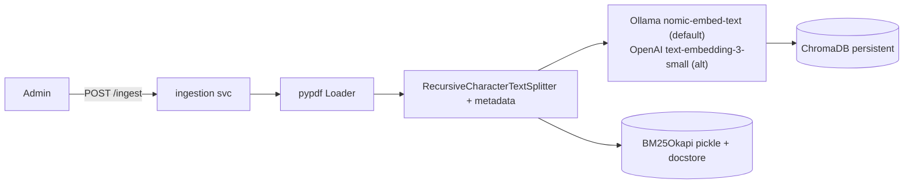
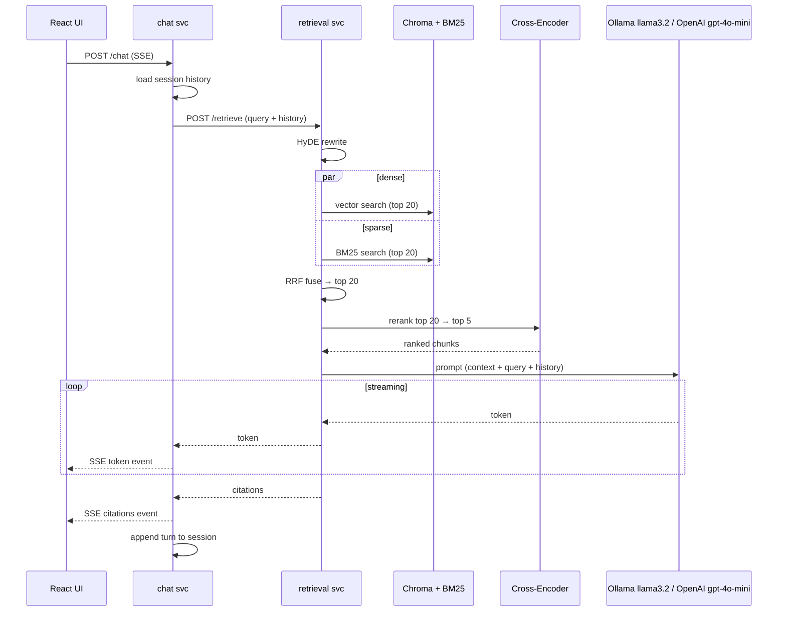

# Architecture

## 1. System Overview
A microservices RAG system over a single private PDF, with a React (JavaScript)
chat frontend, FastAPI backends, ChromaDB (dense) + BM25 (sparse) hybrid
retrieval, Reciprocal Rank Fusion, a local cross-encoder reranker, and
HyDE query rewriting. Ollama (`llama3.2` + `nomic-embed-text`) provides
embeddings + generation by default, with OpenAI as a first-class alternative
behind the same provider abstraction. Evaluated with RAGAS on a synthetic
eval set.

## 2. Repository Layout

/frontend                 React (JS) + Vite + Tailwind chat UI (SSE consumer)
/services
  /ingestion              FastAPI: load → clean → chunk → embed → store
  /retrieval              FastAPI: query → HyDE → hybrid → RRF → rerank → generate (SSE)
  /chat                   FastAPI: conversation state, multi-turn, calls retrieval
/shared                   Installable editable package: config, providers, schemas, logging
/data                     Raw PDF, Chroma persistence, BM25 pickle, eval artifacts
/scripts                  generate_eval_set.py, run_ablation.sh
evaluate.py               RAGAS harness (HTTP client of retrieval service)
docker-compose.yml        Orchestrates services + frontend
Makefile                  dev, ingest, eval, ablation, test shortcuts

See `decisions.md` ADR-018 for why `shared/` is an installable package,
ADR-015 for the monorepo choice, and ADR-022 for the two-provider design.

## 3. Corpus Assumptions
- Single PDF, 10–50 pages, text-native (no OCR)
- English
- Fits comfortably in memory; no sharding needed

## 4. Service Responsibilities

| Service    | Owns                                                  | Talks to                                          | Exposes                                    |
|------------|-------------------------------------------------------|---------------------------------------------------|--------------------------------------------|
| ingestion  | Load PDF, chunk+metadata, embed, upsert Chroma + BM25 | Ollama (default) / OpenAI (alt), Chroma, disk    | POST /ingest, GET /health, GET /collections|
| retrieval  | HyDE, dense+sparse search, RRF, rerank, generation    | Chroma, BM25, Ollama/OpenAI, cross-encoder        | POST /retrieve (SSE), POST /retrieve/sync  |
| chat       | Conversation history, session store, orchestration    | retrieval                                          | POST /chat (SSE), GET /sessions/{id}       |
| frontend   | Chat UI, SSE consumer, citation rendering             | chat                                               | —                                          |

## 5. Data Flow

### 5.1 Ingestion (admin-triggered, offline)

### 5.2 Query (user-triggered, streaming)

## 6. Inter-Service Contracts
- **Transport:** REST over HTTP (ADR-012), async `httpx`
- **Streaming:** SSE (ADR-010)
- **Schemas:** Pydantic v2 models in `shared/schemas/`
- **Failure mode:** chat → retrieval timeout 30s, 1 retry, then graceful
  "I couldn't find an answer" + no citations

## 7. Chunk Metadata Schema
| Field       | Type | Source                        |
|-------------|------|-------------------------------|
| chunk_id    | str  | uuid4                         |
| source      | str  | filename                      |
| page        | int  | pypdf page number (1-indexed) |
| section     | str  | nearest heading (heuristic)   |
| chunk_index | int  | order within doc              |
| char_start  | int  | offset in concatenated text   |
| char_end    | int  | offset                        |
| doc_hash    | str  | sha256 of source PDF          |

## 8. Tech Stack Summary
| Layer         | Choice                                                                    | ADR      |
|---------------|---------------------------------------------------------------------------|----------|
| Vector store  | ChromaDB (persistent, local)                                              | 001      |
| Chunker       | RecursiveCharacterTextSplitter                                            | 002      |
| Embeddings    | Ollama `nomic-embed-text` (768d); OpenAI `text-embedding-3-small` (1536d) alt | 003, 022 |
| Sparse        | rank_bm25 BM25Okapi                                                       | 004      |
| Fusion        | Reciprocal Rank Fusion                                                    | 005      |
| Reranker      | cross-encoder/ms-marco-MiniLM-L-6-v2 local                                | 006      |
| Query rewrite | HyDE (toggleable)                                                         | 007      |
| LLM           | Ollama `llama3.2`; OpenAI `gpt-4o-mini` alt                               | 003, 022 |
| Streaming     | SSE                                                                       | 010      |
| Frontend      | Vite + React (JS) + Tailwind                                              | 011, 019 |
| Comms         | REST (httpx async)                                                        | 012      |
| Shared pkg    | Editable install                                                          | 018      |
| Providers     | Abstraction layer (Ollama + OpenAI)                                       | 016, 022 |
| Runtime       | Ollama at `http://localhost:11434`                                        | 003      |
| Eval          | RAGAS, synthetic eval set                                                 | 009      |
| Deployment    | docker-compose, local                                                     | 017      |

## 9. Non-Goals (demo scope)
- Auth / multi-tenant
- Distributed tracing
- Horizontal scaling of retrieval
- OCR / scanned PDFs

## 10. Future Work (interview talking points)
- RabbitMQ for ingestion queue when corpus grows (ADR-012 note)
- Redis for session store
- OpenTelemetry across services
- Reranker as its own microservice with batching
- Multi-collection Chroma for multi-tenant